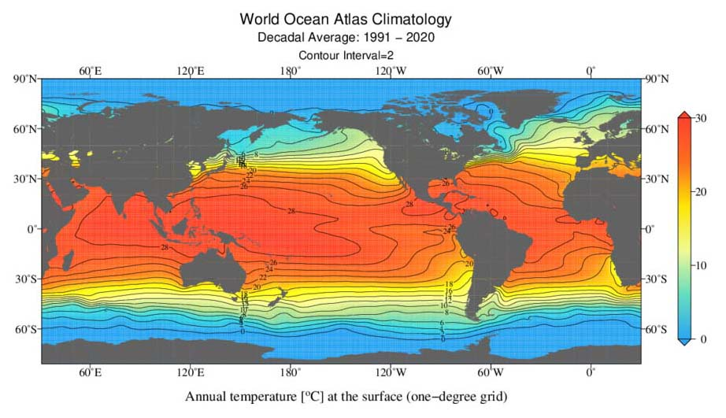

# Normals

> On the heels of a new annual heat record set in 2022 — the latest in a string of record-setting years — average ocean surface temperatures around the globe have spiked since early March. Excluding polar regions, they are about two-tenths of a degree Celsius warmer than scientists have ever observed at this time of year via satellite data.

>[The Washington Post](https://www.washingtonpost.com/climate-environment/2023/04/28/ocean-temperatures-heat-record-surge-climate/), April 28, 2023

## Problem to Solve

How do we know whether ocean temperatures are lower or higher than “normal”? What’s a “normal” temperature? Turns out that scientists have developed a metric called a [“Climate Normal.”](https://www.noaa.gov/explainers/understanding-climate-normals) A Climate Normal characterizes aspects of earth’s [climate](https://en.wikipedia.org/wiki/Climate)—its long-term weather—over a span of 30 years. One important metric is ocean temperature.

In a database called `normals.db`, using a table called normals, explore some of the most recent Climate Normal data to understand what makes a normal ocean temperature around the world.

[Demo](./iframe.html)

## Distribution Code

For this problem, you’ll need to download `normals.db`, along with several `.sql` files in which you’ll write your queries.

### Download the distribution code

Log into [cs50.dev](https://cs50.dev/), click on your terminal window, and execute `cd` by itself. You should find that your terminal window’s prompt resembles the below:

```bash
$
```

Next execute

```bash
wget https://cdn.cs50.net/sql/2023/x/psets/0/normals.zip
```

in order to download a ZIP called `normals.zip` into your codespace.

Then execute

```bash
unzip normals.zip
```

to create a folder called normals. You no longer need the ZIP file, so you can execute

```bash
rm normals.zip
```

and respond with “y” followed by Enter at the prompt to remove the ZIP file you downloaded.

Now type

```bash
cd normals
```

followed by Enter to move yourself into (i.e., open) that directory. Your prompt should now resemble the below.

```bash
normals/ $
```

If all was successful, you should execute

```bash
ls
```

and see a database named normals.db alongside several `.sql` files. Executing `sqlite3 normals.db` should open the database in `sqlite3`, via which you’ll execute SQL queries. If not, retrace your steps and see if you can determine where you went wrong!

## Schema

The data in `normals.db` can be visualized as shown:



Notice that the earth is divided into a grid of [coordinates](https://en.wikipedia.org/wiki/Geographic_coordinate_system)—points that can identify most any location on earth. Each coordinate is a combination of [latitude](https://en.wikipedia.org/wiki/Latitude) and [longitude](https://en.wikipedia.org/wiki/Longitude). And notice how each coordinate over an ocean has some normal ocean surface temperature associated with it!

In `normals.db` you’ll find a single table of coordinates, normals. In `the normals table, you’ll find the following columns:

- `id`, which uniquely identifies each row (coordinate) in the table
- `latitude`, which is the degree of latitude (expressed in decimal format) for the coordinate
- `longitude`, which is the degree of longitude (expressed in decimal format) for the coordinate
- `0m`, which is the normal ocean surface temperature (i.e., the normal temperature at 0 meters of depth), in degrees Celsius, at the coordinate
- `5m`, which is the normal ocean temperature at 5 meters of depth, in degrees Celsius, at the coordinate
- `10m`, which is the normal ocean temperature at 10 meters of depth, in degrees Celsius, at the coordinate

And observations continue until `5500m`, or 5500 meters of depth, for some coordinates!

> Since `normals` is a wide table, if you want to preview the contents, consider `SELECT`ing only the `latitude`, `longitude`, and a few depth columns.

## Specification

For each of the following questions, you should write a single SQL query that outputs the results specified by each problem. Your response must take the form of a single SQL query. You should not assume anything about the ids of any particular observations: your queries should be accurate even if the id of any particular observation were different. Finally, each query should return only the data necessary to answer the question.

1. In `1.sql`, write a SQL query to find the normal ocean surface temperature in the Gulf of Maine, off the coast of Massachusetts. To find this temperature, look at the data associated with [42.5° of latitude and -69.5° of longitude](https://earth.google.com/web/search/42.5,-69.5/@42.53059612,-70.06085518,-25.91667934a,332193.98637213d,35y,-61.00844387h,46.13637382t,0r/data=Ck4aJBIeGQAAAAAAQEVAIQAAAAAAYFHAKgo0Mi41LC02OS41GAIgASImCiQJ14PWOBzcRUARa3Ou0sBqREAZo3t-queTUMAhTWNBzMAfUsA).
   - Recall that you can find the normal ocean surface temperature in the 0m column, which stands for 0 meters of depth!
2. In `2.sql`, write a SQL query to find the normal temperature of the deepest sensor near the Gulf of Maine, at the same coordinate above.
   - The deepest sensor records temperatures at 225 meters of depth, so you can find this data in the `225m` column.
3. In `3.sql`, choose a location of your own and write a SQL query to find the normal temperature at 0 meters, 100 meters, and 200 meters. You might find Google Earth helpful if you’d like to find some coordinates to use!
4. In `4.sql`, write a SQL query to find the lowest normal ocean surface temperature.
5. In `5.sql`, write a SQL query to find the highest normal ocean surface temperature.
6. In `6.sql`, write a SQL query to return all normal ocean temperatures at 50m of depth, as well as their respective degrees of latitude and longitude, within the Arabian Sea. Include latitude, longitude, and temperature columns. For simplicity, assume the Arabian Sea is encased in the following four coordinates:
   - 20° of latitude, 55° of longitude
   - 20° of latitude, 75° of longitude
   - 0° of latitude, 55° degrees of longitude
   - 0° of latitude, 75° degrees of longitude
7. In `7.sql`, write a SQL query to find the average ocean surface temperature, rounded to two decimal places, along the equator. Call the resulting column “Average Equator Ocean Surface Temperature”.

   - The equator’s ocean surface temperatures can be found at all longitudes between the latitudes -0.5° and 0.5°, inclusive.

8. In `8.sql`, write a SQL query to find the 10 locations with the lowest normal ocean surface temperature, sorted coldest to warmest. If two locations have the same normal ocean surface temperature, sort by latitude, smallest to largest. Include latitude, longitude, and surface temperature columns.
9. In `9.sql`, write a SQL query to find the 10 locations with the highest normal ocean surface temperature, sorted warmest to coldest. If two locations have the same normal ocean surface temperature, sort by latitude, smallest to largest. Include latitude, longitude, and surface temperature columns.
10. There are 180 whole degrees of latitude. In `10.sql`, write a SQL query to determine how many points of latitude we have at least one data point for. (Why might we not have data points for all latitudes?)

## Usage

To test your queries as you write them in your `.sql` files, you can query the database by running

.read FILENAME

where FILENAME is the name of the file containing your SQL query. For example,

.read 1.sql

You can also run

$ cat FILENAME | sqlite3 `normals.db` > output.txt

to redirect the output of the query to a text file called output.txt. (This can be useful for checking how many rows are returned by your query!)
How to Test

While check50 is available for this problem, you’re encouraged to instead test your code on your own for each of the following. If you’re using the `normals.db` database provided in this problem’s distribution, you should find that…

    Executing 1.sql results in a table with 1 column and 1 row.
    Executing 2.sql results in a table with 1 column and 1 row.
    3.sql is up to you!
    Executing 4.sql results in a table with 1 column and 1 row.
    Executing 5.sql results in a table with 1 column and 1 row.
    Executing 6.sql results in a table with 3 columns and 383 rows.
    Executing 7.sql results in a table with 1 column and 1 row.
    Executing 8.sql results in a table with 3 columns and 10 rows.
    Executing 9.sql results in a table with 3 columns and 10 rows.
    Executing 10.sql results in a table with 1 column and 1 row.

Note that row counts do not include header rows that only show column names.
Correctness

check50 cs50/problems/2023/sql/normals

How to Submit

In your terminal, execute the below to submit your work.

submit50 cs50/problems/2023/sql/normals

Acknowledgements

Data retrieved from the World Ocean Atlas 2023, publicly available from the National Oceanic and Atmospheric Administration (NOAA).
