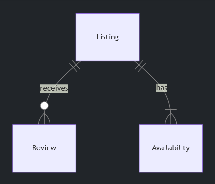

# Bed and Breakfast


*“A bed and breakfast in Boston, the style of a realistic photograph”, generated by [DALL·E 2](https://openai.com/dall-e-2)*

## Problem to Solve

A Bed and Breakfast (“BnB” for short!) is a short-term place one might stay and pay the owner for the service, similar to a hotel. Over the past few years, [AirBnB](https://www.airbnb.com/) has allowed most anyone to rent out their place, whether it’s a home, a cute cottage, or even a treehouse.

You’re a data analyst for the City of Boston and you’re interested in discovering how the rise of AirBnB has changed the local tourist scene. You’ve even compiled a database, `bnb.db`, filled with data directly from AirBnB. In `bnb.db`, whip up a few views that will paint a clearer picture of AirBnB’s influence on the city of Boston.

[Demo](./iframe.html)

## Distribution Code

For this problem, you’ll need to download `bnb.db`, along with a few `.sql` files i`n which you’ll write your queries.

### Download the distribution code

Log into [cs50.dev](https://cs50.dev/), click on your terminal window, and execute `cd` by itself. You should find that your terminal window’s prompt resembles the below:

```bash
$
```

Next execute

```bash
wget https://cdn.cs50.net/sql/2023/x/psets/4/bnb.zip
```

in order to download a ZIP called `bnb.zip` into your codespace.

Then execute

```bash
unzip bnb.zip
```

to create a folder called `bnb`. You no longer need the ZIP file, so you can execute

```bash
rm bnb.zip
```

and respond with “y” followed by Enter at the prompt to remove the ZIP file you downloaded.

Now type

```bash
cd bnb
```

followed by Enter to move yourself into (i.e., open) that directory. Your prompt should now resemble the below.

```bash
bnb/ $
```

If all was successful, you should execute

```bash
ls
```

and see a database named `bnb.db` alongside several `.sql` files. If not, retrace your steps and see if you can determine where you went wrong!

## Schema



Within `bnb.db`, you’ll find three tables that implement the relationships described in the ER diagram above. Click the drop-downs below to learn more about the schema of each table.

### listings table

The listings table contains the following columns:

- `id`, which is the ID of the listing.
- `property_type`, which is the type of the listing (e.g., “Entire rental unit”, “Private room in rental unit”, etc.).
- `host_name`, which is the AirBnB username of the listing’s host.
- `accommodates`, which is the listing’s maximum number of occupants.
- `bedrooms`, which is the listing’s number of bedrooms.
- `description`, which is the description of the listing on AirBnB.

### reviews table

The reviews table contains the following columns:

- `id`, which is the ID of the review.
- `listing_id`, which is the ID of the listin`g which received the review.
- `date`, which is the date the review was posted.
- `reviewer_name`, which is the AirBnB username of the reviewer.
- `comments`, which is the content of the review.

### availabilities table

The availabilities table contains the following columns:

- `id`, which is the id of the availability.
- `listing_id`, which is the listing ID associated with the availability.
- `date`, which is the date of the availability.
- `available`, which is whether the date is still available to be booked (`TRUE` or `FALSE`).
- `price`, which is the price of staying on the given date.

## Specification

In each of the corresponding `.sql` files, write a SQL statement to create each of the following views of the data in `bnb.db`. Note that, while views can be created from other views, each of your views should stand alone (i.e., not rely on a prior view).

### No Descriptions

You might notice that when running

```sql
SELECT * FROM "listings" LIMIT 5;
```

the results look quite wonky! The description column contains descriptions with many line breaks, each o`f which are printed to your terminal.

In `no_descriptions.sql`, write a SQL statement to create a view named `no_descriptions` that includes all of the columns in the listings table except for `description`.

### One-Bedrooms

In `one_bedrooms.sql`, write a SQL statement to create a view named `one_bedrooms`. This view should contain all listings that have exactly one bedroom. Ensure the view contains the following columns:

- `id`, which is the `id` of the listing from the `listings` table.
- `property_type`, from the `listings` table.
- `host_name`, from the `listings` table.
- `accommodates`, from the `listings` table.

### Available

In `available.sql`, write a SQL statement to create a view named `available`. This view should contain all dates that are available at all listings. Ensure the view contains the following columns:

- `id`, which is the `id` of the listing from the `listings` table.
- `property_type`, from the `listings` table.
- `host_name`, from the `listings` table.
- `date`, from the `availabilities` table, which is the date of the availability.

### Frequently Reviewed

In `frequently_reviewed.sql`, write a SQL statement to create a view named `frequently_reviewed`. This view should contain the 100 most frequently reviewed listings, sorted from most- to least-frequently reviewed. Ensure the view contains the following columns:

- `id`, which is the `id` of the listing from the `listings` table.
- `property_type`, from the `listings` table.
- `host_name`, from the `listings` table.
- `reviews`, which is the number of reviews the listing has received.

If any two `listings` have the same number of reviews, sort by `property_type` (in alphabetical order), followed by `host_name` (in alphabetical order).

### June Vacancies

In `june_vacancies.sql`, write a SQL statement to create a view named `june_vacancies`. This view should contain all `listings` and the number of days in June of 2023 that they remained vacant. Ensure the view contains the following columns:

- `id`, which is the `id` of the listing from the `listings` table.
- `property_type`, from the `listings` table.
- `host_name`, from the `listings` table.
- `days_vacant`, which is the number of days in June of 2023, that the given listing was marked as available.

## Usage

To test your views as you write them in your `.sql` files, you can run a query on the database by running

```sql
.read FILENAME
```

where `FILENAME` is the name of the file containing your SQL query. For example,

```sql
.read no_descriptions.sql
```

Keep in mind you can also use

```sql
DROP VIEW name;
```

where name is the name of your view, to remove a view before creating it anew.

## How to Test

While `check50` is available for this problem, you’re encouraged to also test your code on your own.

### Correctness

```bash
check50 cs50/problems/2023/sql/bnb
```

### How to Submit

In your terminal, execute the below to submit your work.

```bash
submit50 cs50/problems/2023/sql/bnb
```

## Acknowledgements

Data retrieved from [insideairbnb.com](http://insideairbnb.com/).
