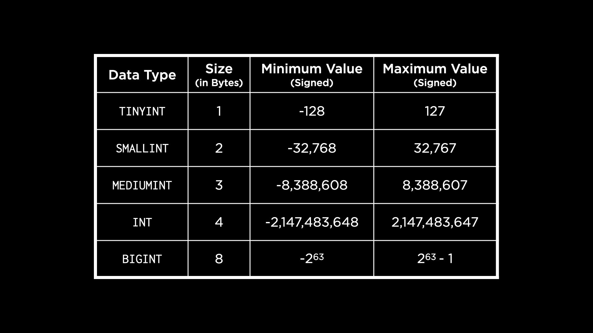
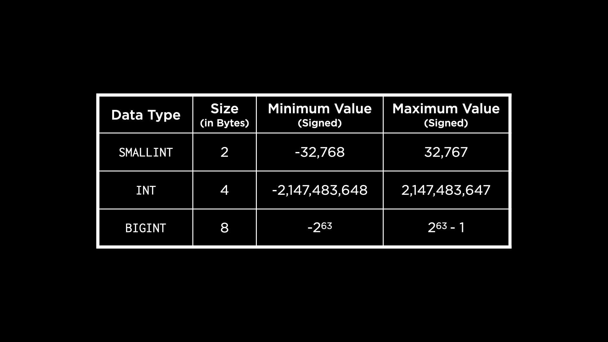

# Lecture 6

- Introduction
- MySQL
- Creating the cards Table
  - Questions
- Creating the stations Table
  - Questions
- Creating the swipes Table
  - Questions
- Altering Tables
- Stored Procedures
  - Questions
- Stored Procedures with Parameters
- PostgreSQL
  - Questions
- Creating PostgreSQL Tables
- Scaling with MySQL
- Access Controls
- SQL Injection Attacks
- Questions
- Fin

## Introduction

- Thus far in this course, we have learned how to design and create our own databases, read and write data and most recently, how to optimize our queries. Now, we will understand how to do all these things but at a larger scale.
- Scalability is the ability to increase or decrease the capacity of an application or database to meet demand.
- Social media platforms and banking systems are examples of applications that might need to scale as they grow bigger and gain more users.
- In this lecture, we will use different database management systems like MySQL and PostgreSQL which can be used to scale databases.
- SQLite is an embedded database, but MySQL and PostgreSQL are database servers — they often run on their own dedicated hardware that we can connect to over the internet to run our SQL queries. This confers them the advantage of being able to store their data on RAM, resulting in faster queries.

## MySQL

- We will use the MBTA database that we have worked with in previous lectures. The following is the ER Diagram showing the entities Card, Swipe and Station and the relationship between these entities.

    

  - As a reminder, riders who use the subway have a CharlieCard they swipe at stations to gain entry. Riders can recharge their cards and in some cases, they need to swipe their cards to leave a station as well. The MBTA does not store information about riders, but only keeps track of the cards.

    We want to create a database in MySQL with this schema! On the terminal, let’s connect to a MySQL server.

    ```bash
    mysql -u root -h 127.0.0.1 -P 3306 -p
    ```

    - In this terminal command, `-u` indicates the user. We provide the user we want to connect to the database as — root (synonymous with database admin, in this case).
    - `127.0.0.1` is the address of local host on the internet (our own computer).
    - `3306` is the port we want to connect to, and this is the default port where MySQL is hosted. Think of the combination of host and port as the address of the database we are trying to connect to!
    - `-p` at the end of the command indicates that we want to be prompted for a password when connecting.
- Since this a full database server with potentially many databases inside it. To show all the existing ones, we use the following MySQL command.

    ```sql
    SHOW DATABASES;
    ```

    This returns some default databases already in the server.

- We will perform some operations to set up the MBTA database. We have seen how to do these in SQLite already, so let’s focus on the syntax differences for MySQL!

  - Creating a new database:

    ```sql
    CREATE DATABASE `mbta`;
    ```

    Instead of quotation marks, we use backticks to identify the table name and other variables in our SQL statements.

  - To change the current database to mbta:

    ```sql
    USE `mbta`;
    ```

## Creating the `cards` Table

- MySQL has more granularity with types than SQLite. For example, an integer could be`TINYINT`,`SMALLINT`,`MEDIUMINT`,`INT` or `BIGINT` based on the size of the number we want to store. The following table shows us the size and range of numbers we can store in each of the integer types.

    

    These ranges assume that we want to use a signed integer. If we use unsigned integers, the maximum value we could store with each integer type would double.

    Let us now create the table `cards` using an INT data type for the ID column. Since an `INT` can store a number up to 4 billion, it should be big enough for our use case!

    ```sql
    CREATE TABLE `cards` (
        `id` INT AUTO_INCREMENT,
        PRIMARY KEY(`id`)
    );
    ```

    Note that we use the keyword `AUTO_INCREMENT` with the ID so that MySQL automatically inserts the next number as the ID for a new row.

### Questions

> Should the ID column not be an unsigned integer? How can we denote that?

- Yes, we could explicitly make the ID an unsigned integer by adding the keyword UNSIGNED while creating the integer.

## Creating the `stations` Table

- After creating the table, we can see a list of the existing tables by running:

    ```sql
    SHOW TABLES;
    ```

    For further details about a table, we can use the `DESCRIBE` command.

    ```sql
    DESCRIBE `cards`;
    ```

- To handle text, MySQL provides many types. Two commonly used ones are `CHAR` — a fixed width string, and `VARCHAR` — a string of variable length. MySQL also has a type `TEXT` but unlike in SQLite, this type is used for longer chunks of text like paragraphs, pages of books etc. Based on the length of the text, it could be one of:`TINYTEXT`, `TEXT`, `MEDIUMTEXT` and `LONGTEXT`. Additionally, we have the BLOB type to store binary strings.
-
- MySQL also provides two other text types: `ENUM` and `SET`. Enum restricts a column to a single predefined option from a list of options we provide. For example, shirt sizes could be enumerated to M, L, XL and so on. A set allows for multiple options to be stored in a single cell, useful for scenarios like movie genres.

- Now, let us create the `stations` table in MySQL.

    ```sql
    CREATE TABLE `stations` (
        `id` INT AUTO_INCREMENT,
        `name` VARCHAR(32) NOT NULL UNIQUE,
        `line` ENUM('blue', 'green', 'orange', 'red') NOT NULL,
        PRIMARY KEY(`id`)
    );
    ```

  - We choose a `VARCHAR` for the station name because names might be an unknown length. The line that a station is on, however, is one of the existing subway lines in Boston. Since we know the values this could take, we can use an `ENUM` type.
  - We also use column constraints `UNIQUE` and `NOT NULL` in the same way as we did with SQLite.
    On running the command to describe this table, we see a similar output that lists out each of the columns in the table. Under the Key field, the primary key is recognized by PRI and any column with unique values is recognized by UNI. The NULL field tells us which columns allow NULL values, which none of the columns do for the stations table.

### Questions

> Can we use a table as the input to `ENUM`?

- This might be possible using a nested SELECT statement but this might not be a good idea if the values within the table change over time. It may be best to explicitly state values as the options for ENUM.

> If we do not know how long a piece of text will be and use something like `VARCHAR(300)` to represent it, is that okay?

- While this is okay, there is a trade-off here. We will lose 300 bytes of memory for every row of data inserted, which might not be worth it if we end up storing only very small strings. It might be better to start off with a smaller length and then alter the table to increase length if needed.

## Creating the `swipes` Table

- MySQL provides us with some options for storing dates and times, while in SQLite they had to be stored using the numeric type.
- We could use`DATE`, `YEAR`, `TIME`, `DATETIME` and `TIMESTAMP` (for more precise times) to store our date and time values. The last three allow an optional parameter to specify the precision with which we want to store the time.

- In SQLite, we had a `REAL` data type. Here, our options are `FLOAT` and `DOUBLE PRECISION` as shown in the table below.

    

  - The amount of precision needs to be specified with the number of bytes, because of floating point imprecision. This means that with a limited amount of memory, floating point numbers can be represented only up to a certain precision. The more the bytes, the more the precision with which the number is represented.
- There is also a way in MySQL to use a decimal (fixed precision) type. With this, we would specify the number of digits in the number to be represented, and the number of digits after the decimal point.

- Let us now create the `swipes` table.

    ```sql
    CREATE TABLE `swipes` (
        `id` INT AUTO_INCREMENT,
        `card_id` INT,
        `station_id` INT,
        `type` ENUM('enter', 'exit', 'deposit') NOT NULL,
        `datetime` DATETIME NOT NULL DEFAULT CURRENT_TIMESTAMP,
        `amount` DECIMAL(5,2) NOT NULL CHECK(`amount` != 0),
        PRIMARY KEY(`id`),
        FOREIGN KEY(`station_id`) REFERENCES `stations`(`id`),
        FOREIGN KEY(`card_id`) REFERENCES `cards`(`id`)
    );
    ```

  - Notice the use of `DEFAULT CURRENT_TIMESTAMP` to indicate that the timestamp should be auto-filled to store the current time if no value is provided.
  - The precision we choose for the swipe amount is 2. This is to ensure that cents get added or subtracted without any rounding.
  - The column constraints from when we created the table in SQLite remain, including the check to make sure the swipe amount is not negative.
    If we describe this table after creating it, we will see familiar output. The `Key` field has a new value, `MUL` (multiple) for the foreign key columns, indicating that they could have repeating values since they are foreign keys.

### Questions

> When we add constraints to a column, is there a precedence with which they take effect?

- No, the constraints work together in a combined manner. MySQL allows us to add constraints in any order while creating the table.

> Does MySQL have type affinities?

- Not exactly. MySQL does have data types, like `INT` and `VARCHAR` but unlike SQLite, it will not allow us to enter data of a different type and try to convert it.

## Altering Tables

- MySQL allows us to alter tables more fundamentally than SQLite did.

- If we wanted to add a silver line to the possible lines a station could be on, we can do the following.

    ```sql
    ALTER TABLE `stations` 
    MODIFY `line` ENUM('blue', 'green', 'orange', 'red', 'silver') NOT NULL;
    ```

  - This allows us to modify the `line` column and change its type, such that the `ENUM` now includes silver as an option.
  - Note also that we use the keyword `MODIFY` in addition to the `ALTER TABLE` construct we are familiar with from SQLite.

## Stored Procedures

- Stored procedures are a way to automate SQL statements and run them repeatedly.
- To demonstrate stored procedures, we will again use a database from previous lectures — the Boston MFA database.
- Recall that we used views in SQLite to implement a soft-delete feature for `collections` in the MFA database. A view `current_collections` displayed all the collections not marked as deleted. We will now use a stored procedure in MySQL to do something similar.

- Let’s navigate to the MFA database already created on our MySQL server.

    ```sql
    USE `mfa`;
    ```

- On describing the `collections` table, we see that the deleted column is not present and needs to be added to the table.

    ```sql
    ALTER TABLE `collections` 
    ADD COLUMN `deleted` TINYINT DEFAULT 0;
    ```

- Given that the deleted column only has values of 0 or 1, it is safe to use a `TINYINT`. We also assign the default as 0 because we want to keep all the collections already in the table.

- Before we create a stored procedure, we need to change the delimited from `;` to something else. Unlike SQLite, where we could type in multiple statements between a `BEGIN` and `END` (which we need for a stored procedure here) and end them with a `;`, MySQL prematurely ends the statement when it encounters a `;`.

    ```sql
    delimiter //
    ```

- Now, we write the stored procedure.

    ```sql
    CREATE PROCEDURE `current_collection`()
    BEGIN
        SELECT `title`, `accession_number`, `acquired` 
        FROM `collections` 
        WHERE `deleted` = 0;
    END//
    ```

- Notice how we use empty parantheses next to the name of the procedure, perhaps reminiscent of functions in other programming languages. Similar to functions, we can also call stored procedures to run them.

- After creating this, we must reset the delimited to `;`.

    ```sql
    delimiter ;
    ```

- Let us try calling this procedure to see the current collections. At this point, the query should output all the rows in the `collections` table because we haven’t soft-deleted anything yet.

    ```sql
    CALL current_collection();
    ```

- If we soft-delete “Farmers working at dawn” and call the procedure again, we will find that the deleted row is not included in the output.

    ```
    UPDATE `collections` 
    SET `deleted` = 1 
    WHERE `title` = 'Farmers working at dawn';
    ```

### Questions

> Can we add parameters to stored procedures, ie, call them with some input?

- Yes, we can and we will see an example shortly!

> Can we call one procedure from another, like with functions?

- Yes. You could put most any SQL statement you write in a procedure as well.

> Can you leave any notes or comments in tables in MySQL?

- That definitely might be a useful feature! You could leave comments in a `schema.sql` file describing the intent behind different parts of the schema, but there may be ways to add comments in SQL tables as well.

## Stored Procedures with Parameters

- When we previously worked with the MFA database, we had a table called `transactions` to log artwork being bought or sold, which we can create here as well.

    ```sql
    CREATE TABLE `transactions` (
        `id` INT AUTO_INCREMENT,
        `title` VARCHAR(64) NOT NULL,
        `action` ENUM('bought', 'sold') NOT NULL,
        PRIMARY KEY(`id`)
    );
    ```

- Now, if a piece of artwork is deleted from `collections` because it is being sold, we would also like to update this in the `transactions` table. Usually, this would be two different queries but with a stored procedure, we can give this sequence one name.

    ```sql
    delimiter //
    CREATE PROCEDURE `sell`(IN `sold_id` INT)
    BEGIN
        UPDATE `collections` SET `deleted` = 1 
        WHERE `id` = `sold_id`;
        INSERT INTO `transactions` (`title`, `action`)
        VALUES ((SELECT `title` FROM `collections` WHERE `id` = `sold_id`), 'sold');
    END//
    delimiter ;
    ```

    The choice of the parameter for this procedure is the ID of the painting or artwork because it is a unique identifier.

- We can now call the procedure to sell a particular item. Suppose we want to sell “Imaginative landscape”.

    ```sql
    CALL `sell`(2);
    ```

    We can display data from the `collections` and `transactions` tables to verify that the changes were made.

- What happens if I call `sell` on the same ID more than once? There is a danger of it being added multiple times to the `transactions` table. Stored procedures can be considerably improved in logic and complexity by using some regular old programming constructs. The following list contains some popular constructs available in MySQL.

    

## PostgreSQL

- So far in this lecture, we’ve seen how to use MySQL, which gives us some ability to scale over what SQLite can provide.
- We will now explore the affordances of PostgreSQL by following the same process as we did with MySQL. We will work with some existing SQLite databases and convert them into PostgreSQL.
- Going back to the MBTA database which had a table `cards`, let’s see what data types are available to us in PostgreSQL.
  - **Integers**

    

    We can observe that there are fewer options here than MySQL. PostgreSQL also provides unsigned integers, similar to MySQL. That would mean double the maximum value shown here can be stored in each inteeger type when working with unsigned integers.

  - **Serial**

    Serials are also integers, but they are serial numbers, usually used for primary keys.

- Let us connect to the database server by opening PSQL — the command line interface for PostgreSQL.

    ```bash
    psql postgresql://postgres@127.0.0.1:5432/postgres
    ```

- We can log in as the default Postgres user or the admin.
- To view all the databases, we can run `\l` and it pulls up a list.

- To create the MBTA database, we can run:

    ```sql
    CREATE DATABASE "mbta";
    ```

- To connect to this specific database, we can run `\c "mbta"`.
- To list out all the tables in the database, we can run `\dt`. Right now, though, we will see no tables within the database.

- Finally, we can create the `cards` table, as proposed. We use a `SERIAL` data type for the ID column.

    ```sql
    CREATE TABLE "cards" (
        "id" SERIAL,
        PRIMARY KEY("id")
    );
    ```

- To describe a table in PostgreSQL, we can use a command like `\d "cards"`. On running this, we see some information about this table but in a slightly different format from MySQL.

### Questions

> How do you know in PostgreSQL if your query is resulting in an error?

- If you hit Enter and the database server does not say ptu, you will know there may be an error. It is also likely that PostgreSQL will give you some helpful error messages to point you in the right direction.

## Creating PostgreSQL Tables

- The `stations` table is created in a similar manner to MySQL.

    ```sql
    CREATE TABLE "stations" (
        "id" SERIAL,
        "name" VARCHAR(32) NOT NULL UNIQUE,
        "line" VARCHAR(32) NOT NULL,
        PRIMARY KEY("id")
    );
    ```

- We can use `VARCHAR` in the same way as in MySQL. To keep things simple, we say that the "line" column id also of the `VARCHAR` type.

- We want to create the swipes table next. Recall that the swipe type can mark entry, exit or deposit of funds in the card. Similar to MySQL, we can use an `ENUM` to capture these options, but do not include it in the column definition. Instead, we create our own type.

    ```sql
    CREATE TYPE "swipe_type" AS ENUM('enter', 'exit', 'deposit');
    ```

- PostgreSQL has types`TIMESTAMP`, `DATE`, `TIME` and `INTERVAL` to represent date and time values. `INTERVAL` is used to capture how long something took, or the distance between times. Similar to MySQL, we can specify the precision with these types.
- A key difference with real number types in PostgreSQL is that the `DECIMAL` type is called `NUMERIC`.

- We can now go ahead and create the swipes table as the following.

    ```sql
    CREATE TABLE "swipes" (
        "id" SERIAL,
        "card_id" INT,
        "station_id" INT,
        "type" "swipe_type" NOT NULL,
        "datetime" TIMESTAMP NOT NULL DEFAULT now(),
        "amount" NUMERIC(5,2) NOT NULL CHECK("amount" != 0),
        PRIMARY KEY("id"),
        FOREIGN KEY("station_id") REFERENCES "stations"("id"),
        FOREIGN KEY("card_id") REFERENCES "cards"("id")
    );
    ```

    For the default timestamp, we use a function provided to us by PostgreSQL called `now()` thst gives us the current timestamp!

- To exit PostgreSQL, we use the command `\q`.

## Scaling with MySQL

- Consider a database server for an application growing in demand. As the number of reads and writes coming in from the application begin to increase, the wait time for the queries to be processed by the server increases also.
- One approach here is to scale the database vertically. Scaling vertically is increasing capacity by increasing the computing power of the database server.
- Another approach is to scale horizontally. This means increasing capacity by distributing load across multiple servers. When we scale horizontally, we keep copies of our database on multiple servers (replication).
- There are three main models of replication: single-leader, multi-leader, and leaderless. Single-leader replication involves a single database server handling incoming writes and then copying those changes into other servers, while multi-leader replication involves multiple servers receiving updates, leading to increased complexity. Leaderless replication uses a different approach altogether that does not require leaders in this sense.
- Here, we will focus on the **single-leader model of replication**. In this model, the follower database server is a read replica: a copy of the database from which data may only be read. The leader server is designated to process writes to the database.
- Once the leader processes a write request, it could wait for the followers to replicate changes before doing anything else. This is called **synchronous replication**. While this ensures the database is always consistent, it may be too slow in responding to queries. In applications like finance or healthcare, where data consistency is extremely important, we might choose this kind of communication despite the disadvantages.
- Another kind is **asynchronous replication**, wherein the leader communicates with follower databases asynchronously to ensure changes are replicated. This method could be used in social media applications, where speed of response is extremely important.
- Another popular way of scaling is called **sharding**. This involves splitting the database into shards across multiple database servers. A word of caution with sharding: we want to avoid having a database hotspot, or a database server that becomes more frequently accessed than others. This could create an overload on that server.
- Another problem arises when we use sharding without replication. In this case, if one of the servers goes down, we will have an incomplete database. This creates a single point of failure: if one system goes down, our entire system is not usable.

## Access Controls

- Previously, we logged into MySQL using the root user. However, we can also create more users and give them some kind of access to the database.

- Let’s create a new user called Carter (feel free to try with your own name here)!

    ```sql
    CREATE USER 'carter' IDENTIFIED BY 'password';
    ```

- We can log into MySQL now using the new user and password, in the same way we did with the root user previously.

- When we create this new user, by default it has very few privileges. Try the following query.

    ```sql
    SHOW DATABASES;
    ```

    This only displays some of the default databases in the server.

- If we log in again with the root user and run the above query, many more databases show up! This is because the root user has access to most everything in the server.
- Let us look at how we can grant access to users by discussing an example from previous weeks. We had a `rideshare` database with a `rides` table. In this table, we stored the names of riders, which is personally identifiable information (PII). We created a view called analysis which anonymized the names of the riders, intending to share only this view with an analyst or other user.

- If we wanted to share the `analysis` view with the user we just created, we would do the following while logged in as the root user.

    ```sql
    GRANT SELECT ON `rideshare`.`analysis` TO 'carter';
    ```

- Now, let’s log in as the new user and verify that we can access the view. We are now able to run

    ```sql
    USE `rideshare`;
    ```

- The only part of the database, however, that this user can access is the `analysis` view. We can now see the data in this view, but not from the original `rides` table! We just demonstrated the benefit of MySQL’s access control: we can have multiple users accessing the database but only allow some to access confidential data.

## SQL Injection Attacks

- One way to increase security of our database is to use access control and grant only the necessary privileges to each user. However, our applications that use an SQL database could also be exposed to attacks — one of them is an SQL injection attack.
- As the name indicates, this involves a malicious user injecting some SQL phrases to complete an existing query within our application in an undesirable way.

- For example, a website that asks a user to log in with their username and password may be running a query like this on the database.

    ```sql
    SELECT `id` FROM `users`
    WHERE `user` = 'Carter' AND `password` = 'password';
    ```

- In the above example, the user Carter entered their username and password as per usual. However, a malicious user could enter something different, like the string “password’ OR ‘1’ = 1” as their password. In this case, they are trying to gain access to the entire database of users and passwords.

    ```sql
    SELECT `id` FROM `users`
    WHERE `user` = 'Carter' AND `password` = 'password' OR '1' = '1';
    ```

- In MySQL, we can use prepared statements to prevent SQL injection attacks. Let’s connect to MySQL with the user we created previously and change to the bank database.

- An example of an SQL injection attack that can be run to display all user accounts from the `accounts` table is this.

    ```sql
    SELECT * FROM `accounts`
    WHERE `id` = 1 UNION SELECT * FROM `accounts`;
    ```

- A prepared statement is a statement in SQL that we can later insert values into. For the above query, we can write a prepared statement.

    ```sql
    PREPARE `balance_check`
    FROM 'SELECT * FROM `accounts`
    WHERE `id` = ?';
    ```

    The question mark in the prepared statement acts as a safeguard against the unintended execution of SQL code.

- To actually run this statement now and check someone’s balance, we accept user input as a variable and then plug it into the prepared statement.

    ```sql
    SET @id = 1;
    EXECUTE `balance_check` USING @id;
    ```

    In the above code, imagine the `SET` statement to be procuring the user’s ID through the application! The @ is a convention for variables in MySQL.

- The prepared statement cleans up input to ensure that no malicious SQL code is injected. Let’s try to run the same statements as above but with a malicious ID.

    ```sql
    SET @id = '1 UNION SELECT * FROM `accounts`';
    EXECUTE `balance_check` USING @id;
    ```

    This also gives us the same results as the previous code — it shows us the balance of the user with ID 1 and nothing else! Thus, we have prevented a possible SQL injection attack.

### Questions

> In this example of prepared statement, does it take into account only the first condition from the variable?

- The prepared statement does something called escaping. It finds all the portions of the variable that could be malicious and escapes them so they don’t actually get executed.

> Is this similar to the reason we shouldn’t use formatted strings in Python to execute an SQL query?

- Yes, format strings in Python have the same pitfall where they are susceptible to SQL injection attacks.

## Fin

- This brings us to the conclusion of Lecture 6 about Scaling in SQL and this course — CS50’s Introduction to Databases with SQL!
